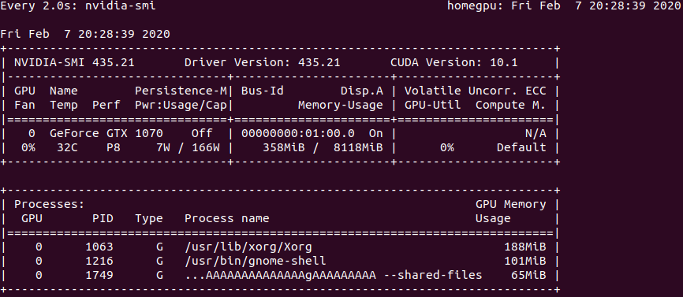

# PyTorch-YOLOv3
A minimal PyTorch implementation of YOLOv3, with support for training, inference and evaluation.


## New files added after original repository fork
- `original-README.md`: Original YOLOv3 repository README.
- `robosub_conda_env.txt`: File containing all requirements for `robosub` conda environment.
- `install_anaconda.sh`: For installing Anaconda.
- `iter_train_benchmark.py`: Benchmark to test if number of increased number of training images improves accuracy.
- `category_benchmark.py`: Benchmark to test if training on different categories of images improves accuracy.
- `live.py`: Detect on single input image using trained model.
- `to_cpu.py`: Convert CUDA model and weights to CPU model and weights.


## Pre-Installation for Root User
1. Create user and give sudo permissions.
```
sudo adduser [username]
usermod -aG sudo [username]
```
2. Copy over robosub conda environment requirements file to the new user.
```
sudo cp -r ~/robosub/yolov3/robosub_conda_env.txt /home/[username]
```


## Pre-Installation for Regular User
- Link to [original repository](https://github.com/eriklindernoren/PyTorch-YOLOv3.git).
- Link to [Triton Robosub repository](https://github.com/triton-robosub/PyTorch-YOLOv3).
1. Use TMUX always. Refer to this [repo](https://gist.github.com/MohamedAlaa/2961058) for TMUX cheatsheet.
```
tmux new -s myname
tmux a -t myname
```
2. Install Anaconda on Ubuntu 18.04.
```
sh install_anaconda.sh && exit
```
3. Create Robosub conda environment.
```
conda create --name robosub --file robosub_conda_env.txt
```
4. Activate the robosub conda environment.
```
conda activate robosub
```
5. Clone this repository.
```
git clone https://github.com/triton-robosub/PyTorch-YOLOv3.git
```
6. Confirm that nobody else is using the GPU. Under "Volatile GPU-Util" the pecentage should be 0% if it is not being used. If it is being used, it will be approximately 80% or above.
```
watch nvidia-smi
```
<p align="center"></p>


## Creating a Custom Model
1. Custom Model: Run the commands below to create a custom model definition, replacing `<num-classes>` with the number of classes in your dataset.
```
cd config/                                # Navigate to config dir
bash create_custom_model.sh <num-classes> # Will create custom model 'yolov3-custom.cfg'
mv yolov3-custom.cfg yolov3-[NEW_NAME].cfg
```
2. Classes: Add class names to `data/[NEW_NAME]/classes.names`. This file should have one row per class name.
```
cd data/
mkdir [NEW_NAME]
cd [NEW_NAME]
touch classes.names  # file to edit
```
3. Image Folder: Move the images of your dataset to `data/[NEW_NAME]/images/`.
```
cd data/
cd [NEW_NAME]
mkdir images  # move images into this directory
```
4. Annotation Folder: Move your annotations to `data/[NEW_NAME]/labels/`. The dataloader expects that the annotation file corresponding to the image `data/[NEW_NAME]/images/train.jpg` has the path `data/[NEW_NAME]/labels/train.txt`. Each row in the annotation file should define one bounding box, using the syntax label_idx x_center y_center width height. The coordinates should be scaled [0, 1], and the label_idx should be zero-indexed and correspond to the row number of the class name in `data/[NEW_NAME]/classes.names`.
```
cd data/
cd [NEW_NAME]
mkdir labels  # each img test.jpg in data/[NEW_NAME]/images/ needs a corresponding test.txt
```
5. Define Train and Validation Sets: In `data/[NEW_NAME]/train.txt` and `data/[NEW_NAME]/valid.txt`, add paths to images that will be used as train and validation data respectively.
```
cd data/
cd [NEW_NAME]
touch train.txt  # File to store paths to images for train
touch valid.txt  # File to store paths to images for validation
```
6. Create .data files for data_config.
```
cd config/
touch [NEW_NAME].data

#### Add these lines into the file created above ####
classes=[NUM_CLASSES]
train=data/[NEW_NAME]/train.txt
valid=data/[NEW_NAME]/valid.txt
names=data/[NEW_NAME]/classes.names
```
7. [OPTIONAL]: Download `yolov3.weights` for pretrained weights.
```
cd weights/
bash download_weights.sh
```


## Necessary Files
1. config/yolov3-[NEW_NAME].cfg
    - Model definition for `<NUM_CLASSES>` made from create custom model script. Contains model architecture (YOLO, ReLU, convolutional, etc. layers)
2. config/[NEW_NAME].data
    - Number of classes and paths to train.txt, valid.txt, and classes.names
3. data/[NEW_NAME]/train.txt
    - Paths to each image for training. 
4. data/[NEW_NAME]/valid.txt
    - Paths to each image for validation.
5. data/[NEW_NAME]/classes.names
    - Names of classes to identify
6. data/[NEW_NAME]/images
    - Directory to store .jpg files for images
7. data/[NEW_NAME]/labels
    - Directory to store .txt files for images


## Training Parameters
1. [--epochs EPOCHS]
    - Number of epochs to train on. An epoch is one complete presentation of the data set to be learned. Training and validation loss will decrease over time. Early stopping can be applied. After each epoch of training, the model weights are saved in `checkpoints/`
2. [--batch_size BATCH_SIZE]
    -  The number of images processed by GPU in a batch. Anything higher than this will result in a CUDA memory error for this GPU. The batch size is too large when a CUDA memory error is thrown, just keep reducing the batch size.
3. [--gradient_accumulations GRADIENT_ACCUMULATIONS]
    - Number of gradient accumulations before step.
4. [--model_def MODEL_DEF]
    - Path to model definition file. Provides the framework (size of convolution layers, etc) of the YOLOv3 network, and was generated with the bash command to create a custom model. 
5. [--data_config DATA_CONFIG]
    - Path to data config file. Provides paths to classes.names, train.txt, and valid.txt as well as the number of classes.
6. [--pretrained_weights PRETRAINED_WEIGHTS]
    - Starts from checkpoint model that has partially trained weights.
7. [--n_cpu N_CPU]
    - Number of cpu threads to use during batch generation.
8. [--img_size IMG_SIZE]
    - Size of each image dimension.
9. [--checkpoint_interval CHECKPOINT_INTERVAL]
    - Interval between saving model weights.
10. [--evaluation_interval EVALUATION_INTERVAL]
    - Interval evaluations on validation set.
11. [--compute_map COMPUTE_MAP]
    - If True computes mAP every tenth batch.
12. [--multiscale_training MULTISCALE_TRAINING]
    - To ease the inconsistency between the sizes of objects and receptive
fields, object detection is performed with multiple output layers,
each focusing on objects within certain scale ranges.


## YOLOV3 Training
### Training parameters
```
$ train.py [-h] [--epochs EPOCHS] [--batch_size BATCH_SIZE]
                [--gradient_accumulations GRADIENT_ACCUMULATIONS]
                [--model_def MODEL_DEF] [--data_config DATA_CONFIG]
                [--pretrained_weights PRETRAINED_WEIGHTS] [--n_cpu N_CPU]
                [--img_size IMG_SIZE]
                [--checkpoint_interval CHECKPOINT_INTERVAL]
                [--evaluation_interval EVALUATION_INTERVAL]
                [--compute_map COMPUTE_MAP]
                [--multiscale_training MULTISCALE_TRAINING]
```

### Training with pretrained weights
```
python -W ignore train.py --model_def config/yolov3-[NEW_NAME].cfg --data_config config/[NEW_NAME].data --epochs [NUM_EPOCHS] --batch_size [NUM_BATCHES] --pretrained_weights weights/yolov3.weights
```

### Training with new weights
```
python -W ignore train.py --model_def config/yolov3-[NEW_NAME].cfg --data_config config/[NEW_NAME].data --epochs [NUM_EPOCHS] --batch_size [NUM_BATCHES]
```

### Detecting
```
python detect.py --image_folder /data/[NEW_NAME]/images --model_def config/yolov3-[NEW_NAME].cfg --class_path data/[NEW_NAME]/classes.names --checkpoint_model PATH_TO_PTH/[FILENAME].pth --batch_size [NUM_BATCHES]
```

### Testing
```
python test.py --model_def config/yolov3-[NEW_NAME].cfg --data_config config/[NEW_NAME].data --weights_path PATH_TO_PTH/[FILENAME].pth --class_path data/[NEW_NAME]/classes.names --batch_size [NUM_BATCHES]
```

### Live
```
python live.py --img_path PATH_TO_IMG/[IMG] --checkpoint_model PATH_TO_PTH/[FILENAME].pth
```